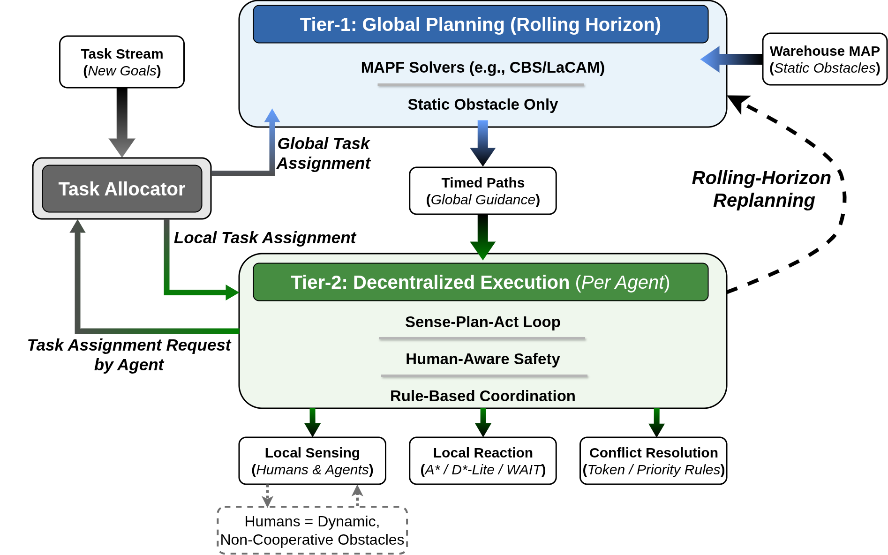

# Partially Observable Exogenous-agent Lifelong MAPF (POE-LMAPF)

> **⏸ PAUSED — read [`reports/audit/RESUME_DECISION.md`](reports/audit/RESUME_DECISION.md) before resuming.**
> The experimental section requires a re-run; an 11-step audit found
> every committed sweep fails its own validity contract and the
> metric repair has never been read into a paper-side aggregation.
> Do not regenerate sweeps before reading the verdict and the
> resume-sequence gate logic.  See [`RESUME.md`](RESUME.md) for the
> short pointer.

A **two-tier planning framework** for Partially Observable
Exogenous-agent Lifelong Multi-Agent Path Finding in dynamic warehouse
environments.

> **Previous submission:** the SoCS2026 version of this repository was
> titled *Human-Aware Lifelong Multi-Agent Path Finding under Partial
> Observability* (HA-LMAPF).  POE-LMAPF is the renamed, revised
> version; the codebase keeps the legacy ``ha_lmapf`` package name and
> ``human``-prefixed identifiers for backward compatibility.

This repository provides a complete research implementation
emphasising clarity, reproducibility, and strong baselines.

> **Terminology.**  The paper text refers to dynamic non-controlled
> entities as **exogenous agents**.  The codebase uses ``human``
> (e.g. ``HumanState``, ``humans/`` package) for the same entity.
> The two terms are interchangeable.

---

## Table of Contents

- [Problem Definition](#problem-definition)
- [Proposed Approach](#proposed-approach)
- [Project Structure](#project-structure)
- [Installation](#installation)
- [Quick Start](#quick-start)
- [Documentation](#documentation)
- [Benchmarks and Evaluation](#benchmarks-and-evaluation)
- [Reproducibility](#reproducibility)
- [License](#license)

---

## Problem Definition

### Lifelong MAPF in warehouses with exogenous agents

We address **Lifelong Multi-Agent Path Finding (L-MAPF)** in warehouse
environments where:

<div align="center">

| Challenge                 | Description                                                          |
|---------------------------|----------------------------------------------------------------------|
| **Continuous Operation**  | Agents operate indefinitely; tasks arrive continuously               |
| **Exogenous Agents**      | Unpredictable non-controlled agents move through the environment     |
| **Partial Observability** | Agents have limited field-of-view (FoV)                              |
| **Safety Requirements**   | Agents must maintain safety buffers around exogenous agents          |
| **High Throughput**       | System must maximise task completion rate                            |

</div>

### Classical MAPF vs. our setting

<div align="center">

| Aspect        | Classical MAPF   | POE-LMAPF (this work)                  |
|---------------|------------------|----------------------------------------|
| Tasks         | One-shot         | Continuous lifelong stream             |
| Environment   | Static           | Dynamic (exogenous agents)             |
| Observability | Full             | Partial (limited FoV)                  |
| Agents        | Cooperative only | Cooperative + unpredictable exogenous agents |
| Horizon       | Single plan      | Rolling horizon ($H = 20$, $R = 10$)   |
| Safety        | Collision-free   | Buffer-aware safety + Theorem 1 (no agent-attributable violations) |

</div>

### Formal Problem Statement

Given:

- A grid environment `G = (V, E)` with static obstacles.
- A set of `k` controlled agents with positions `s_i(t)`.
- A set of `m` exogenous agents `X(t) = {h_1, ..., h_m}` with unpredictable trajectories.
- A continuous lifelong stream of tasks `T = {(start, goal, release_time)}`.
- Field-of-view radius `r_fov` for each agent.
- Safety radius `r_safe` around each exogenous agent.

Objective: maximise throughput while ensuring the **buffer-aware
safety constraint**

```
s_i(t+1) ∉ B_{r_safe}(X_t^{Phi_i})
```

where `X_t^{Phi_i}` is the set of exogenous agents observed by `a_i`
at decision time `t`.  Theorem 1 (paper §4.5) shows the executed
actions never cause an **agent-attributable** buffer violation
(see ``docs/proposed_approach.md`` §F).

---

## Proposed Approach

### Two-tier planning architecture

The system separates planning into two complementary tiers:

<div align="center">



</div>

### Tier 1: Global planning  (paper Algorithm 1)

The global planner operates on a **rolling horizon** ($H = 20$,
$R = 10$):

1. **Task allocation** — greedy nearest-task with commitment
   persistence; Hungarian and auction allocators are also available.
2. **MAPF solve** — paper default is **LaCAM\*** (factory string
   ``lacam_official``); CBSH2-RTC, LaCAM, MAPF-LNS2, PBS, PIBT2 are
   also wired in.
3. **Periodic re-plan every $R$ steps**, plus emergency triggers for
   exhaustion, major deviation, and the **$\eta_w = 0.20$ Safe-Wait
   fraction trigger** (paper §4.4).

### Tier 2: Local execution  (paper Algorithm 2)

Each agent runs a **Sense → Plan → Resolve** loop every tick:

1. **Sense**: build local observation from FoV ($r_{\mathit{fov}} = 4$).
2. **Plan**: form the forbidden set
   $F = B_{r_{\mathit{safe}}}(X^{\Phi_i}_t) \cup D(t)_{\mathit{ext}}$;
   if the global plan's next cell is in $F$, run a buffer-aware local
   A\*.
3. **Resolve**: agent-agent vertex / edge contention via the
   configured resolver; the loser's fallback respects $F$ (Theorem 1
   invariant).

> The Sense step builds the observation directly from FoV; the
> SoCS2026 version included an explicit MyopicPredictor stage but the
> paper's reported pipeline uses the FoV-only observation.

#### Safety modes

<div align="center">

| Mode            | Description                                  | Use case                   |
|-----------------|----------------------------------------------|----------------------------|
| **Hard safety** | Agents NEVER enter $F$                       | Strict safety requirements |
| **Soft safety** | $F$ is high-cost but passable                | Deadlock prevention        |

</div>

#### Conflict-resolution strategies

<div align="center">

| Strategy           | Communication | Description                              |
|--------------------|---------------|------------------------------------------|
| **Priority Rules** | None          | Deterministic priority $\rho_i = (-d_i + \beta\,\mathbf{1}[w_i > w^*],\; w_i,\; -i)$ |
| **Token Passing**  | Required      | Cell ownership via tokens, fairness rotation |
| **PIBT**           | None          | Push-based with backtracking (auxiliary) |

</div>

---

## Project Structure

```
ha_lmapf/
├── README.md                          # This file
├── docs/
│   ├── GETTING_STARTED.md            # Beginner's guide
│   ├── README_TESTS.md               # Test documentation
│   ├── experimental_setup.md         # Paper experimental setup
│   ├── metrics.md                    # Metrics reference
│   ├── fine_tune.md                  # Hyperparameter tuning guide
│   └── proposed_approach.md          # Algorithm description
├── src/ha_lmapf/
│   ├── core/                         # Core types and utilities
│   ├── global_tier/                  # Tier-1 global planning
│   │   └── solvers/                  # MAPF solvers (CBS, LaCAM)
│   ├── local_tier/                   # Tier-2 local execution
│   │   └── conflict_resolution/      # Conflict resolvers
│   ├── humans/                       # Human models and prediction
│   ├── simulation/                   # Simulation engine
│   ├── io/                           # Input/Output utilities
│   ├── gui/                          # Visualization
│   ├── task_allocator/               # Task allocation algorithms
│   └── baselines/                    # Baseline implementations
├── scripts/                          # Runnable scripts
│   └── evaluation/                   # Evaluation and plotting
├── configs/                          # Configuration files
│   └── eval/                         # Paper evaluation configs
├── data/
│   ├── maps/                         # Map files
│   └── task_streams/                 # Task stream files
├── tests/                            # Test suite (359 tests)
└── logs/                             # Experiment outputs
```

### Module Documentation

<div align="center">

| Module                  | Description                              | Documentation                                                                                              |
|-------------------------|------------------------------------------|------------------------------------------------------------------------------------------------------------|
| **Core**                | Types, interfaces, grid utilities        | [README_CORE.md](src/ha_lmapf/core/README_CORE.md)                                                         |
| **Global Tier**         | Rolling horizon planner, task allocation | [README_GLOBAL_TIER.md](src/ha_lmapf/global_tier/README_GLOBAL_TIER.md)                                    |
| **Solvers**             | CBS, LaCAM MAPF algorithms               | [README_SOLVERS.md](src/ha_lmapf/global_tier/solvers/README_SOLVERS.md)                                    |
| **Local Tier**          | Agent controller, local planner          | [README_LOCAL_TIER.md](src/ha_lmapf/local_tier/README_LOCAL_TIER.md)                                       |
| **Conflict Resolution** | Token passing, priority rules, PIBT      | [README_CONFLICT_RESOLUTION.md](src/ha_lmapf/local_tier/conflict_resolution/README_CONFLICT_RESOLUTION.md) |
| **Humans**              | Motion models, prediction, safety        | [README_HUMANS.md](src/ha_lmapf/humans/README_HUMANS.md)                                                   |
| **Simulation**          | Environment, dynamics, events            | [README_SIMULATION.md](src/ha_lmapf/simulation/README_SIMULATION.md)                                       |
| **I/O**                 | Map loading, task streams, replay        | [README_IO.md](src/ha_lmapf/io/README_IO.md)                                                               |
| **GUI**                 | PyGame visualization                     | [README_GUI.md](src/ha_lmapf/gui/README_GUI.md)                                                            |
| **Baselines**           | Comparison implementations               | [README_BASELINES.md](src/ha_lmapf/baselines/README_BASELINES.md)                                          |

</div>

---

## Installation

### Requirements

- Python **3.10+**
- Minimal dependencies (no heavy ML frameworks)

### Install

```bash
# Clone the repository
git clone <REPO_URL>
cd ha_lmapf

# Create virtual environment
python3 -m venv .venv
source .venv/bin/activate  # Linux/macOS
# .venv\Scripts\activate   # Windows

# Install dependencies
pip install -r requirements.txt
pip install -e .

# Optional: GUI support
pip install pygame

# Optional: Testing
pip install pytest
```

For detailed installation instructions, see [**GETTING_STARTED.md**](docs/GETTING_STARTED.md).

---

## Quick Start

### Run GUI Visualization

```bash
# Lifelong MAPF with configuration file
python scripts/run_gui.py --config configs/warehouse_small.yaml

# One-shot classical MAPF
python scripts/run_oneshot_gui.py --agents 15 --solver cbs

# Human-aware demonstration
python scripts/run_oneshot_hamapf_gui.py --agents 10 --humans 5
```

### Run Experiments

```bash
# Run baseline comparison
python scripts/evaluation/run_evaluation.py --group baselines --seeds 0 1 2 --out logs/results

# Run all experiments
python scripts/evaluation/run_evaluation.py --out logs/full_evaluation
```

### Run Tests

```bash
# Run all tests
python -m pytest tests/ -v

# Run specific category
python -m pytest tests/test_cbs_solver.py -v
```

---

## Documentation

<div align="center">

| Document                                                       | Description                                              |
|----------------------------------------------------------------|----------------------------------------------------------|
| [**GETTING_STARTED.md**](docs/GETTING_STARTED.md)              | Complete beginner's guide with step-by-step instructions |
| [**README_TESTS.md**](docs/README_TESTS.md)                    | Comprehensive test suite documentation                   |
| [**experimental_setup.md**](docs/experimental_setup.md)        | Paper experimental setup and parameters                  |
| [**metrics.md**](docs/metrics.md)                              | Detailed metrics reference                               |
| [**fine_tune.md**](docs/fine_tune.md)                          | Hyperparameter tuning guide                              |
| [**proposed_approach.md**](docs/proposed_approach.md)          | Algorithm and architecture description                   |

</div>

---

## Benchmarks and Evaluation

### Experiment Groups

<div align="center">

| Group              | Description                                           | Experiments      |
|--------------------|-------------------------------------------------------|------------------|
| `baselines`        | Ours vs. RHCR vs. PIBT2-FR vs. No-Buffer (paper §5.5) | 4 baselines      |
| `scalability`      | Agent count $\in \{10, 25, 50, 100, 200, 300, 500\}$ | 7 configurations |
| `exogenous_density` | Human count $\in \{0, 5, 10, 20\}$                  | 4 configurations |
| `safety_radius_sweep` | $r_{\mathit{safe}} \in \{0, 1, 2, 3\}$ (paper §5.3) | 4 configurations |
| `eta_w_sweep`      | $\eta_w \in \{0.0, 0.1, 0.2, 0.3, 0.5\}$ (paper §5.4) | 5 configurations |
| `solver_comparison`| CBSH2-RTC, LaCAM, LaCAM\*, MAPF-LNS2, PBS, PIBT2     | 6 solvers        |
| `map_types`        | random-64-64-10, warehouse-10-20-10-2-1, warehouse-10-20-10-2-2 | 3 maps  |
| `ablations`        | Disable components                                    | 4+ configurations |

</div>

### Metrics

<div align="center">

| Metric                                  | Description                                                    |
|-----------------------------------------|----------------------------------------------------------------|
| **Throughput**                          | Tasks completed per time step                                  |
| **Flowtime / makespan**                 | Task completion timing                                         |
| **`violations_agent_attributable`**     | Buffer overlaps caused by an executed agent move (Theorem 1: 0) |
| **`violations_exogenous_attributable`** | Buffer overlaps caused by exogenous-agent encroachment         |
| **`wait_fraction`**                     | $\sum \mathrm{wait\_steps} / (\#agents \times \mathrm{steps})$ |
| **Planning time** (mean / p95 / max)    | Wall-clock per replan call                                     |
| **`solver_timeouts`**                   | Replan attempts that produced no useful plan                   |

</div>

See ``docs/experimental_setup.md`` for the full metrics surface.

### Maps

The paper evaluates on three standard MovingAI MAPF benchmark maps —
``random-64-64-10`` (64×64), ``warehouse-10-20-10-2-1`` (161×63), and
``warehouse-10-20-10-2-2`` (170×84).  All three are checked into
``data/maps/``; ``scripts/download_maps.sh`` re-fetches them from the
MovingAI repository idempotently.

---

## Reproducibility

This repository ensures full reproducibility:

- **Seeds**: 10 seeds (0–9) per configuration; all randomness is
  controlled by ``SimConfig.seed``.
- **Configs**: paper-aligned defaults in ``configs/eval/default.yaml``;
  per-experiment configs sit alongside.
- **Logs**: each run outputs ``results.csv`` (all metrics) and
  ``replay.json`` (full trajectories) under ``logs/eval/<group>/``.
- **Determinism**: all planners and resolvers are deterministic given
  the seed.
- **Paper figure mappings**: the experiment groups in
  ``configs/eval/`` are named to match the paper's figure numbers
  (e.g. ``baselines`` → Fig. 4, ``scalability`` → Fig. 5,
  ``safety_radius_sweep`` → Fig. 6, ``eta_w_sweep`` → Fig. 7).
- **Verification suite**: ``pytest tests/`` runs the full suite
  including Theorem 1 invariant tests (``tests/test_theorem1_*.py``)
  and metric invariants (``tests/test_metrics_invariants.py``).

---

## Baselines

<div align="center">

| Baseline      | Tier-1                       | Tier-2                                | Buffer-aware? |
|---------------|------------------------------|---------------------------------------|---------------|
| **Ours (POE-LMAPF)** | Rolling horizon + LaCAM\* | Sense-Plan-Resolve, F-respecting     | ✓             |
| **RHCR**      | RHCR rolling horizon         | ``GlobalOnlyController`` (rigid)      | ✗             |
| **PIBT2-FR**  | PIBT2 with $R = 1$, $H = 20$ | ``GlobalOnlyController`` (rigid)      | ✗             |
| **No-Buffer** | Same as Ours                 | Same as Ours, ``r_safe = 0``           | trivially     |

</div>

The baseline factory helpers live in ``ha_lmapf.baselines``:
``make_pibt2_fr_config``, ``make_no_buffer_config``,
``make_rhcr_blind_config``.  Earlier ablation baselines
(``GlobalOnly``, ``PIBT-Only``, ``Ignore-Humans``, ``WHCA*``) remain
available but are not part of the paper's main comparison table.

---

## License

This project is licensed under the MIT License - see the [LICENSE](LICENSE) file for details.
