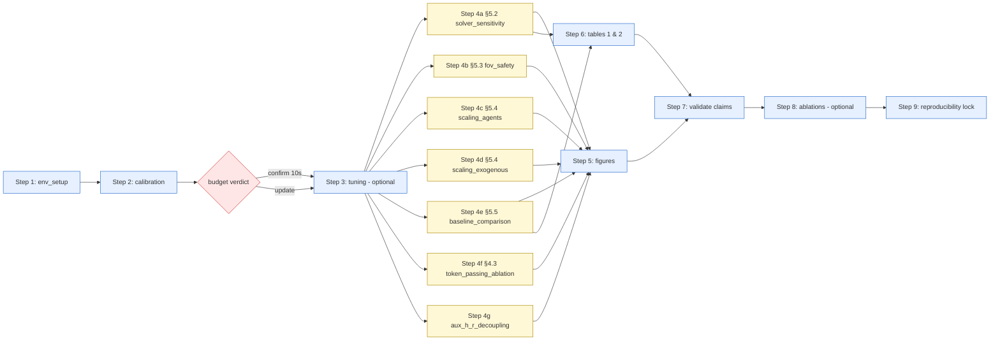

> **This document is generated by inspection.** It reflects the state
> of the repository at the commit shown above. If you change a
> script's CLI, a YAML config, or the dependency structure between
> scripts, regenerate this document by re-running the
> RUN_PAPER_FROM_ZERO prompt. Do not edit it manually — manual edits
> will be overwritten on next regeneration.

# Reproducing POE-LMAPF from Zero

Last regenerated: 2026-05-09
Generated against commit: ec9bdd380c06cf35a4e9daba73db740a090d9083
Estimated total wall-clock: 80–200 core-hours for the full §5.2–§5.5 + §4.3 + auxiliary sweep on a single 16-core workstation. Best-case (median per-replan timing scaled by 6450 runs / 16 workers ≈ 1.6 hours of replan compute, dominated by simulator overhead → ~10 hours wall) and worst-case (every replan saturates the 10 s budget on warehouse-scale high-density cells → ~225 hours wall) bracket the realistic outcome.

## 1. Overview

This document is the canonical recipe for taking a fresh clone of the
POE-LMAPF repository and producing every figure, every table, and the
reproducibility lock referenced by the paper, end to end. It assumes
no prior runs have been completed. The pipeline produces seven sweep
result CSVs under `logs/paper/<sweep>/`, the seven paper figures under
`figures/paper/`, the two summary tables under `tables/paper/`,
appendix-grade pairwise statistics under `stats/paper/<sweep>/`, the
claim-validation report at `reports/claim_validation.md`, and the
release lock under `docs/reproducibility/`. Skip conditions are
documented for each step so re-runs can short-circuit work that is
already done.

## 2. Pipeline diagram



## 3. Prerequisites

**Hardware.** A workstation with at least 16 physical cores and 32 GB
RAM is the realistic minimum; the §5.2 sweep alone is 3360 runs and
the per-run wall clock varies from ~3 seconds (low-density random map)
to ~2000 seconds (warehouse-10-20-10-2-2 at |M|=200 with LaCAM\*
saturating the 10 s solver budget every replan). Cluster execution
via `--seed-shard i/N` is supported; see Step 4 below.

**OS / Python.** Ubuntu 24.04 LTS (or any distribution shipping glibc
≥ 2.35) and Python 3.10 or newer. The repository ships pinned
requirements in `requirements.txt` plus the package itself via
`pip install -e .`.

**Solver binaries.** All six paper solvers ship pre-built under
`src/ha_lmapf/global_tier/solvers/`. Their runtime requirements per
`docs/SOLVER_STATUS.md` are:

| Solver | Status on CI image | Library requirements |
|---|---|---|
| LaCAM (`lacam_official`) | Working | statically linked |
| LaCAM\* (`lacam3`) | Working | statically linked |
| CBSH2-RTC (`cbsh2`) | Working | `libboost-program-options1.74.0` |
| MAPF-LNS2 (`lns2`) | Working | `libboost-program-options1.74.0` |
| PBS (`pbs`) | Working | `libboost-program-options1.74.0` |
| PIBT2 (`pibt2`) | Working (post-fix) | statically linked |

Ubuntu 24.04 ships Boost 1.83 by default; the legacy package
`libboost-program-options1.74.0` is required for CBSH2-RTC, LNS2 and
PBS. Without it, those three exit with code 127 and the wrappers fall
back to all-WAIT plans.

The `EECBSSolver` and `RHCRSolver` wrappers are present but excluded
from the paper sweep: EECBS is not referenced and the RHCR binary
segfaults on this CI image (see SOLVER_STATUS § "Per-wrapper
migration status" and the `coarse` MIGRATION_DEPTH note).

**Per-replan time budget.** Every paper YAML pins
`solver_timeout_s: 10.0`, in line with the standard MAPF benchmark
budget in the LaCAM\* / MAPF-LNS2 literature. The earlier 5 s budget
was empirically too tight: calibration showed LaCAM\* hits the wall on
warehouse-10-20-10-2-2 at |M|=200, motivating the 10 s bump (see
`docs/PAPER_TODO.md` § "§5.1 Per-replan time budget bumped 5 s →
10 s" and `docs/SOLVER_STATUS.md` § "10-second timeout enforcement").
The current production budget is 10 s as of commit 95c89a9.

## 4. Step 1: Environment setup

### 1a. Clone, create venv, install

```bash
git clone <repo-url> EUMAS-POE-LMAPF-test
cd EUMAS-POE-LMAPF-test
git checkout ec9bdd380c06cf35a4e9daba73db740a090d9083

python3 -m venv .venv
source .venv/bin/activate
pip install --upgrade pip
pip install -r requirements.txt
pip install -e .

sudo apt-get install -y libboost-program-options1.74.0 \
                        libboost-filesystem1.74.0
```

**Expected output.** `pip install -e .` ends with
`Successfully installed ha-lmapf-…`. The apt step is silent on
success and reports `127 not configured` on a missing package.

### 1b. Download maps

```bash
bash scripts/download_maps.sh
```

The three paper maps are checked into `data/maps/` already
(33 `.map` files total). The script is idempotent: it re-fetches from
MovingAI only when a map is missing.

**Expected output.** A list ending with `data/maps/random-64-64-10.map`,
`data/maps/warehouse-10-20-10-2-1.map`,
`data/maps/warehouse-10-20-10-2-2.map`.

### 1c. Verify solver binaries

```bash
pytest tests/test_solver_smoke.py tests/test_solver_timeout.py -v
```

This runs the per-solver 8×8 / 3-agent smoke and the subprocess
timeout enforcement test against every wrapper. All six paper-sweep
solvers (CBSH2-RTC, LaCAM, LaCAM\*, MAPF-LNS2, PBS, PIBT2) must show
PASSED. If any solver SKIPs because its binary is missing, restore
the binary (re-clone or rebuild from the linked upstream) before
proceeding — calibration and §5.x sweeps cannot tolerate a missing
paper solver.

**Expected output.** Two test files, ~20 tests total, all PASSED. A
`SKIPPED [N]` summary on PIBT2 / RHCR is acceptable only for solvers
not in your target sweep; for the paper, all six must pass.

### 1d. Full test suite sanity check

```bash
pytest tests/ -q
```

The full suite is ~420 tests and runs in ~30 seconds. Up to 11 SKIPs
are normal on CI images that lack the optional GUI dependencies. Any
FAIL is a hard stop — fix the failure (or report it) before
proceeding.

**Expected output.** A line of the form
`409 passed, 11 skipped in 30.42s`. The integration gate
`tests/test_full_migration_manifest.py` (23 tests) must be entirely
green: it asserts every paper-sweep solver returns the
five-way `SolverStatus` enum and parses a non-NaN `solver_wall_ms`.

## 5. Step 2: Calibration

The calibration sweep collects per-replan timing distributions for
every (solver × map × |M|) cell that the §5.x sweeps will touch. Its
output drives two decisions: which solvers to include in each
section's cohort (per a completion-rate threshold), and whether the
§5.1 per-replan time budget is correctly sized.

### Skip condition

If `logs/calibration/solver_recommendation.md` already exists and
its first 50 lines reference the **current commit's** solver set with
no SOLVER_STATUS deltas since the last calibration run, you may skip
to Step 3. Concretely: open
`logs/calibration/solver_recommendation.md`, confirm that its
"Generated from <N> plan_with_metadata invocations across 6 solvers"
header agrees with the six paper solvers in
`docs/SOLVER_STATUS.md` § "Solver registry", and re-use it.

If the calibration was run against an older `solver_timeout_s` (5 s)
the wall-time numbers under-represent saturation; re-running is
recommended after any wrapper change in
`src/ha_lmapf/global_tier/solvers/`.

### 2a. Run the calibration sweep

```bash
python scripts/calibrate_solver_budgets.py \
    --out logs/calibration \
    --time-limit 10.0 \
    --workers $(nproc)
```

This script writes `logs/calibration/raw_measurements.csv` with one
row per `plan_with_metadata` invocation across the
(solver × map × |M| × seed × replan_idx) grid. The default grid
exercises every paper-sweep solver, all three paper maps, and a
density grid that hits saturation on warehouse-10-20-10-2-2. The
default `--replans-per-cell` and `--seeds` produce roughly 650
invocations on the cohort the analyzer expects.

**Wall-clock estimate.** 30 minutes at the low end (random + small
warehouse cells finish under a second each) to 3 hours at the high end
when LaCAM\* and MAPF-LNS2 routinely saturate the 10 s budget on the
warehouse-2-2 high-density cells. The calibration row count visible
in the shipped CSV (649 lines) corresponds to a 1.5-hour run.

### 2b. Analyze the calibration

```bash
python scripts/analyze_calibration.py \
    --in  logs/calibration/raw_measurements.csv \
    --out logs/calibration
```

This emits three markdown reports next to the CSV:

* `logs/calibration/solver_recommendation.md` — per-section solver
  inclusion table + §5.1 budget recommendation.
* `logs/calibration/anytime_verification.md` — algorithm class vs
  harness behavior per solver.
* `logs/calibration/literature_consistency.md` — measured p50/p95 vs
  published claims.

### 2c. Decision point: confirm or update §5.1's budget

Read the "§5.1 budget recommendation" footer at the bottom of
`logs/calibration/solver_recommendation.md`. Three branches:

* **CONFIRMED at 10 s.** No further action; proceed to Step 3.
* **INCONCLUSIVE.** This is the verdict in the shipped report — the
  warehouse-10-20-10-2-2 |M|=450 cell is missing or all-error at the
  10 s budget, and LaCAM\* hits 10 s already at |M|=200. The data
  nevertheless support the 10 s budget over the older 5 s budget;
  proceed unless you have reason to push higher. If you do bump,
  update `solver_timeout_s` in every `configs/eval/paper/*.yaml` and
  in `src/ha_lmapf/core/types.py` (`SimConfig.solver_timeout_s`)
  uniformly — see PAPER_TODO § "§5.1 Per-replan time budget".
* **TOO TIGHT (recommend ≥ N s).** Apply the bump as above and
  re-run calibration once before any §5.x sweep starts.

The per-section solver-inclusion tables are advisory: the paper YAMLs
already pin the specific solver subset for each sweep, and the
calibration only flags subsets you should consider dropping if a
solver's completion rate at the cohort threshold (95 % for §5.2,
80 % for §5.4, 85 % for §5.5) is below floor.

## 6. Step 3: Tuning (optional)

The hyperparameter tuning suite under `scripts/tuning/` is exploratory
and predates the paper sweep. The §5.x default values (`horizon=20`,
`replan_every=10`, `fov_radius=4`, `safety_radius=1`,
`commit_horizon` and `delay_threshold` defaults from `default.yaml`)
are baked into the paper YAMLs and reflect a frozen design point. Run
the tuning suite **only** if you have a reason to revisit the
defaults — for example, you have changed the simulator or a solver
wrapper in a way that might shift the optimal point.

### Skip condition

If you accept the §5.1 default `(H, R, FoV, safety) = (20, 10, 4, 1)`
listed in PAPER_TO_CODE_MAP and PAPER_TODO, skip to Step 4. The
paper YAMLs hard-pin these values and the §5.2 horizon sweep exercises
the H dimension as data, not as tuning.

The tuning suite below assumes no skip; output lands under
`logs/tuning/<timestamp>/` for each step.

### 3a. Tune horizon (Step 1)

Default invocation (single solver `lacam`, all four maps, 15 seeds, 10 s
budget, results written incrementally to a fresh timestamped directory):

```bash
python scripts/tuning/tune_horizon.py --workers $(nproc) --no-latex
```

**Full recipe — all six solvers × all three maps, 10 seeds, 10 s budget,
incremental flush.**  This is the paper-grade Step 1 sweep and replaces
ad-hoc per-solver re-runs.  Results land in
`logs/tuning/horizon/<timestamp>/results.csv`, with one row appended
**per completed run** (no end-of-sweep buffer); `.heartbeat` updates
each completion so progress is visible mid-run.

```bash
python scripts/tuning/tune_horizon.py \
    --solver all \
    --seeds 0 1 2 3 4 5 6 7 8 9 \
    --budget-s 10.0 \
    --workers $(nproc) \
    --no-latex
```

Grid: 6 solvers × 3 maps × (4 small-map agent counts or 4 large-map
agent counts) × 8 horizons × 10 seeds = **5 760 runs**.  At 8 cores
this is multi-day work; see `docs/SWEEPS_EXECUTION_GUIDE.md` for the
`tmux + nohup` launch pattern and the same `--resume` semantics this
script supports.

Monitor mid-run:

```bash
# One-shot progress snapshot
cat logs/tuning/horizon/<dir>/.heartbeat

# Live row-count
watch -n 10 'wc -l logs/tuning/horizon/<dir>/results.csv'

# Stream rows as they land
tail -f logs/tuning/horizon/<dir>/results.csv
```

Resume after interruption (Ctrl+C, OOM, machine reboot) — the script
skips rows already in `results.csv` via the
`(solver, map_tag, num_agents, horizon, seed)` key:

```bash
python scripts/tuning/tune_horizon.py \
    --resume \
    --output-dir logs/tuning/horizon/<dir> \
    --solver all \
    --seeds 0 1 2 3 4 5 6 7 8 9 \
    --budget-s 10.0 \
    --workers $(nproc) \
    --no-latex
```

Solver aliases recognised by `--solver`: `lacam` (alias of LaCAM
Official), `lacam3` (LaCAM\*), `lns2`, `pibt2`, `pbs`, `cbsh2-rtc`.
Use `--solver all` to enable every paper solver in one invocation.

If you only need to subsample for a quicker exploration, override
`--maps` (e.g. `random warehouse_small`), `--values` (e.g. `20 50 75`),
or shorten `--seeds` to 0..4.  All other flags default to the
paper-aligned settings.

### 3b. Tune replan_every (Step 2)

```bash
python scripts/tuning/tune_replan_every.py --workers $(nproc) \
    --best-horizon 20
```

The `--best-horizon` value should come from 3a's `summary.csv`.

### 3c. Tune FoV radius (Step 4)

```bash
python scripts/tuning/tune_fov_radius.py --workers $(nproc) \
    --best-horizon 20 --best-replan-every 10
```

### 3d. Tune safety radius (Step 5)

```bash
python scripts/tuning/tune_safety_radius.py --workers $(nproc) \
    --best-horizon 20 --best-replan-every 10 --best-fov-radius 4
```

### 3e. Joint FoV × safety grid (Step 6)

```bash
python scripts/tuning/tune_fov_safety.py --workers $(nproc)
```

This grid is the single best validation that the per-axis tunes did
not miss an interaction; the paper §5.3 sweep is a lower-resolution
restatement.

### 3f. Joint commit_horizon × delay_threshold (Step 7)

```bash
python scripts/tuning/tune_commit_delay.py --workers $(nproc) \
    --best-horizon 20 --best-replan-every 10 \
    --best-fov-radius 4 --best-safety-radius 1
```

### 3g. Compare to §5.1 defaults

For every tuning summary `summary.csv` written by 3a–3f, compare its
per-parameter best to the §5.1 defaults `(H=20, R=10, FoV=4,
safety=1)`. If a step's best diverges, decide whether to update the
paper YAMLs or to keep the defaults and treat the divergence as
sensitivity data.

## 7. Step 4: Paper experiment sweeps

Each sweep YAML under `configs/eval/paper/` is the source of truth
for one paper section. The harness `run_paper_experiment.py`
is idempotent under `--resume` (it keys on the SHA-256 `run_id`
derived from the canonical-form config dict, so a stale CSV row from
a prior partial run is reused only when its YAML cell is byte-identical
to the current one).

Sweeps with `reference_condition` set in their YAML auto-invoke
`statistical_analysis.py` at the end of the sweep. **Verified by
inspection of the seven YAMLs** at the head commit:

| Sweep | `reference_condition` set? | Stats invocation |
|---|---|---|
| `solver_sensitivity` | yes (`lacam_official`) | **auto** |
| `baseline_comparison` | yes (`ours`) | **auto** |
| `fov_safety` | no | **manual** |
| `scaling_agents` | no | **manual** |
| `scaling_exogenous` | no | **manual** |
| `token_passing_ablation` | no | **manual** |
| `aux_h_r_decoupling` | no | **manual** |

For every sweep, the canonical invocation is

```bash
python scripts/evaluation/run_paper_experiment.py \
    --config configs/eval/paper/<sweep>.yaml \
    --out    logs/paper/<sweep> \
    --workers $(nproc) --resume
```

Run them in parallel across nodes if you have a cluster, or
sequentially on one workstation. The `--resume` flag is safe to pass
on every invocation — fresh runs ignore it, and crashed runs pick up
where they left off.

### 4a. §5.2 — solver_sensitivity (3360 runs)

```bash
python scripts/evaluation/run_paper_experiment.py \
    --config configs/eval/paper/solver_sensitivity.yaml \
    --out    logs/paper/solver_sensitivity \
    --workers $(nproc) --resume
```

Auto-invokes `statistical_analysis.py` against `lacam_official` over
`global_solver,map_path,horizon,num_agents`.

### 4b. §5.3 — fov_safety (400 runs)

```bash
python scripts/evaluation/run_paper_experiment.py \
    --config configs/eval/paper/fov_safety.yaml \
    --out    logs/paper/fov_safety \
    --workers $(nproc) --resume
```

No auto-stat. If you want appendix-grade pairwise stats, invoke
`statistical_analysis.py` manually with a chosen reference condition.

### 4c. §5.4 part 1 — scaling_agents (1040 runs)

```bash
python scripts/evaluation/run_paper_experiment.py \
    --config configs/eval/paper/scaling_agents.yaml \
    --out    logs/paper/scaling_agents \
    --workers $(nproc) --resume
```

No auto-stat. Manual invocation against `lacam_official` if needed:

```bash
python scripts/evaluation/statistical_analysis.py \
    --results logs/paper/scaling_agents \
    --out     stats/paper/scaling_agents \
    --groupby global_solver,map_path,num_agents,num_humans \
    --against lacam_official \
    --metrics throughput,violations_agent_attributable,wait_fraction
```

### 4d. §5.4 part 2 — scaling_exogenous (760 runs)

```bash
python scripts/evaluation/run_paper_experiment.py \
    --config configs/eval/paper/scaling_exogenous.yaml \
    --out    logs/paper/scaling_exogenous \
    --workers $(nproc) --resume
```

No auto-stat. Manual stat invocation as for 4c if needed.

### 4e. §5.5 — baseline_comparison (720 runs)

```bash
python scripts/evaluation/run_paper_experiment.py \
    --config configs/eval/paper/baseline_comparison.yaml \
    --out    logs/paper/baseline_comparison \
    --workers $(nproc) --resume
```

Auto-invokes `statistical_analysis.py` against `ours` over
`method,map_path,num_agents,num_humans` for metrics
`throughput, violations_agent_attributable,
violations_exogenous_attributable, wait_fraction`. Note this sweep
runs at `simulation_steps = 1500` (paper §5.5 uses a shorter run);
the harness validates this against the
`PAPER_SECTION_TO_STEPS` registry in `run_paper_experiment.py` and
fast-fails if the YAML's `steps` field disagrees.

### 4f. §4.3 — token_passing_ablation (60 runs)

```bash
python scripts/evaluation/run_paper_experiment.py \
    --config configs/eval/paper/token_passing_ablation.yaml \
    --out    logs/paper/token_passing_ablation \
    --workers $(nproc) --resume
```

No `reference_condition` set in YAML. Run statistical_analysis
manually against `priority`:

```bash
python scripts/evaluation/statistical_analysis.py \
    --results logs/paper/token_passing_ablation \
    --out     stats/paper/token_passing_ablation \
    --groupby communication_mode,num_agents \
    --against priority \
    --metrics throughput,violations_exogenous_attributable,wait_fraction
```

### 4g. Auxiliary — aux_h_r_decoupling (110 runs)

```bash
python scripts/evaluation/run_paper_experiment.py \
    --config configs/eval/paper/aux_h_r_decoupling.yaml \
    --out    logs/paper/aux_h_r_decoupling \
    --workers $(nproc) --resume
```

No `reference_condition`. This sweep is response-letter material;
no manual stat invocation required by the paper.

### Total run count and wall-clock

Total Step 4 runs: 3360 + 400 + 1040 + 760 + 720 + 60 + 110 = **6450**.

Per-run wall-clock is bimodal: low-density cells (random map,
warehouse-10-20-10-2-1 at |M| ≤ 100) finish in 3–30 seconds at the
calibration-measured median; high-density cells (warehouse-10-20-10-2-2
at |M| ≥ 100, all four solvers) routinely saturate the 10 s
solver budget on every replan, pushing per-run wall to ~2000 seconds
(200 replans × 10 s). Calibration's median end-to-end per-replan is
71 ms across the cells where solvers complete. From the same data
the p95 is ~10 091 ms — confirming the saturation tail. With 16
workers:

* **Best case** (every cell median): 6450 × 14 s / 16 ≈ 1.6 hours.
* **Worst case** (every cell saturating): 6450 × 2000 s / 16 ≈ 224 hours.
* **Realistic** (mixed): the §5.2 + §5.4 + §5.5 high-density cells
  on warehouse-2-2 dominate, putting the full sweep at **80–200
  core-hours** on a 16-core workstation.

Use `--seed-shard i/N` for cluster execution; see REPRODUCING_PAPER §
"Sharding across a cluster" for the canonical merge step.

## 8. Step 5: Generate paper figures

The figure generator's `--figure` flag accepts a single named figure
or `all`. The mapping from figure name to source sweep is fixed in
code; the loop below runs every paper figure individually so a
single failed figure does not abort the rest.

```bash
mkdir -p figures/paper

for fig in horizon fov_safety scaling_agents scaling_exogenous \
           baselines h_r_decoupling token_passing_ablation; do
    case $fig in
        horizon)                src=solver_sensitivity ;;
        fov_safety)             src=fov_safety ;;
        scaling_agents)         src=scaling_agents ;;
        scaling_exogenous)      src=scaling_exogenous ;;
        baselines)              src=baseline_comparison ;;
        h_r_decoupling)         src=aux_h_r_decoupling ;;
        token_passing_ablation) src=token_passing_ablation ;;
    esac
    python scripts/evaluation/plot_paper_figures.py \
        --results logs/paper/$src \
        --out     figures/paper \
        --figure  $fig
done
```

**Expected output.** Files under `figures/paper/`:
`horizon_sweep_*.png`, `fov_safety_<map>.png`, `scaling_agents_*.png`,
`scaling_exogenous_*.png`, `baseline_<map>.png`,
`aux_h_r_decoupling.png`, `token_passing_ablation.png`, plus
`_combined.png` overlays. All at 200 DPI with 95 % bootstrap CI bands.

## 9. Step 6: Generate paper tables

```bash
mkdir -p tables/paper

# Table 1 — Tier-1 solver substitutability (filters to H=20).
python scripts/evaluation/build_summary_tables.py \
    --results logs/paper/solver_sensitivity \
    --out     tables/paper --table 1

# Table 2 — Baseline comparison (filters to warehouse-10-20-10-2-2).
python scripts/evaluation/build_summary_tables.py \
    --results logs/paper/baseline_comparison \
    --out     tables/paper --table 2
```

**Expected output.**
`tables/paper/table1_solver_substitutability.{md,tex}` and
`tables/paper/table2_baseline_comparison.{md,tex}`. The
`H = 20` and `warehouse-10-20-10-2-2` filters are hardcoded in the
script.

## 10. Step 7: Validate paper claims

```bash
mkdir -p reports

python scripts/evaluation/validate_paper_claims.py \
    --claims        docs/PAPER_NUMERICAL_CLAIMS.yaml \
    --results-root  logs/paper \
    --out           reports/claim_validation.md \
    --tables-out    reports/claim_validation_tables.tex \
    --section       all
```

The report groups every claim in `docs/PAPER_NUMERICAL_CLAIMS.yaml`
by verdict; the verdict literals are fixed and exclusive. What to do
per verdict (mirror of `docs/PAPER_TODO.md` § "Paper prose updates
after re-running experiments"):

* **Confirmed.** No action — the paper sentence matches the data
  within tolerance.
* **Now stronger.** The data exceeds the paper's claim. Decide
  whether to tighten the prose; check the supporting plot before doing
  so.
* **Now weaker.** The data is in the right direction but below the
  paper's stated magnitude. Either soften the prose or — only after
  sanity-checking — relax the tolerance threshold in
  `docs/PAPER_NUMERICAL_CLAIMS.yaml`.
* **Refuted.** The data contradicts the paper sentence. Replace the
  sentence per the report's "Suggested replacement sentences"
  subsection. This is a hard stop for resubmission until cleared.
* **Skipped.** A required result CSV was missing. Re-run the
  corresponding sweep before treating any other verdict as final.

The companion `reports/claim_validation_tables.tex` provides
booktabs LaTeX with cell-level auto-tabulation for Tables 1 and 2,
yellow-highlighted as a hint to cross-check against the paper PDF.
After a paper-side LaTeX edit, re-run the validator and confirm
zero remaining **Refuted** or **Now weaker** entries.

## 11. Step 8: Run ablations (if needed)

The ablation suite (`scripts/ablation/run_ablation_study.py`) covers
Group A (tier architecture) and Group B (safety / perception). The
paper §5.6 references these results.

### Skip condition

If `logs/ablation/<label>_<ts>/results.csv` exists and post-dates the
last code change to either `src/ha_lmapf/global_tier/` or
`src/ha_lmapf/safety/`, skip this step. The ablation harness has no
`--resume` support; it overwrites unless `--label` is fresh. Re-run
only when source has actually changed.

### Run

```bash
python scripts/ablation/run_ablation_study.py \
    --workers $(nproc) \
    --label paper_ablation
```

Default behaviour: 10 seeds, two maps (`random-64-64-10` 50/20 and
`warehouse-10-20-10-2-1` 250/100), Groups A and B, paired Wilcoxon,
BH-FDR, BCa 95 % CIs, Friedman omnibus, post-hoc power. Output lands
under `logs/ablation/paper_ablation_<ts>/`.

### Plot

```bash
python scripts/ablation/plot_ablation.py \
    logs/ablation/paper_ablation_<ts>/summary.csv \
    --raw logs/ablation/paper_ablation_<ts>/results.csv
```

This emits 10 figures (bar, forest, scatter, heatmap, violin,
normality, power) under
`logs/ablation/paper_ablation_<ts>/plots/`.

## 12. Step 9: Reproducibility lock

**MUST RUN LAST.** This script captures the current git commit, the
Python version, the full `pip freeze`, and SHA-256 hashes of every
`configs/**/*.yaml` and every `logs/**/results.csv` under the repo.
Running it before sweeps complete leaves missing-`results.csv` gaps in
the manifest — the harness silently skips them rather than erroring.

```bash
python scripts/lock_reproducibility.py --out docs/reproducibility/
```

**Expected output.** Four files under `docs/reproducibility/`:
`environment.txt` (python + pip freeze), `config_hashes.txt`,
`results_hashes.txt`, `MANIFEST.md` (commit SHA + counts).

### Verification before submission

```bash
python scripts/lock_reproducibility.py --check-only
```

`--check-only` re-hashes live files and compares against the recorded
manifest. A nonzero exit code indicates drift — investigate before
treating the lock as a release artefact.

## 13. Common pitfalls

* **Boost 1.74 not installed.** CBSH2-RTC, MAPF-LNS2 and PBS exit
  with code 127 and the wrappers fall back to all-WAIT plans. The
  symptom is silent: throughput drops to floor, violations spike,
  and there is no Python traceback. Always run Step 1c
  (`pytest tests/test_solver_smoke.py`) on a fresh node and confirm
  CBSH2/LNS2/PBS PASSED before any paper sweep.

* **PIBT2 prior numbers are wrong.** Per
  `docs/PAPER_TODO.md` § "PIBT2 max_timestep wrapper fix": every
  PIBT2 throughput number in any pre-fix draft of §5.4 / §5.5 was
  produced with `max_timestep = horizon + 50`, insufficient on
  warehouse-scale maps. The wrapper now uses
  `max(horizon + 50, 2 × (height + width))`. Always re-run §5.4 /
  §5.5 PIBT2 cells after touching `pibt2_wrapper.py`.

* **`--resume` is sensitive to YAML edits.** The `run_id` is the
  SHA-256 of the canonical config dict. Editing a `base:` field
  invalidates every previous row in `results.csv` for that sweep,
  but `--resume` will still skip rows whose old `run_id` happens to
  match — and produce silently mixed-vintage data. After any YAML
  edit, delete the old `results.csv` and start fresh, or rename the
  output directory.

* **Calibration vs production budget.** The calibration script
  takes `--time-limit` for its own sweep, which is independent of
  the production `solver_timeout_s` pinned in the paper YAMLs. Do
  not assume changes to one carry to the other. The §5.1 budget is
  driven by the paper YAMLs and `SimConfig.solver_timeout_s` — see
  PAPER_TODO § "§5.1 Per-replan time budget".

* **`lock_reproducibility.py` silent-skips missing dirs.** If
  `logs/` or one of its sweep subdirectories does not exist, no
  error is raised — the manifest simply has no row for it. Always
  confirm every sweep produced a `results.csv` *before* running
  Step 9. The simplest sanity check is
  `ls logs/paper/*/results.csv | wc -l` — it must report 7.

* **`max_timestep` vs `horizon` for PIBT2.** PIBT2's
  `max_timestep` is computed from map dimensions, not from
  `horizon`. Mode B priority-scheme deadlock on confined corridors
  (e.g., the mini-warehouse fixture) is algorithmic; do not blame
  the wrapper. See `docs/PIBT2_DIAGNOSIS.md` § Resolution.

* **Step ordering matters.** Step 9 (lock) must be last. Step 7
  (validate_paper_claims) requires every Step 4 sweep to have
  written its `results.csv`; otherwise Skipped verdicts will appear
  for unrelated claims. Step 5 / Step 6 can interleave freely once
  Step 4 finishes.

* **RHCR binary is broken on this CI image.** Per SOLVER_STATUS,
  the RHCR binary segfaults and its `MIGRATION_DEPTH` is `coarse`.
  RHCR is a §5.5 baseline (`method: rhcr` in
  `baseline_comparison.yaml`); confirm RHCR runs end-to-end on your
  hardware before treating §5.5 numbers as final, and rebuild from
  upstream if needed.

## 14. Estimated total time

| Step | Wall-clock (16 cores) | Notes |
|---|---|---|
| 1 — env setup | 5–10 min | Dominated by `pip install -r requirements.txt`. |
| 2 — calibration | 30 min – 3 hr | Depends on warehouse-2-2 saturation rate; the shipped 649-row CSV took ~1.5 hr. |
| 3 — tuning (optional) | 4–12 hr | All seven steps; skip if accepting §5.1 defaults. |
| 4a — §5.2 (3360 runs) | 30–80 hr | Dominated by warehouse-2-2 high-density cells where every solver saturates the 10 s budget every replan. |
| 4b — §5.3 (400 runs) | 4–8 hr | LaCAM\* only; warehouse-2-2 |M|=50 cells are fast. |
| 4c — §5.4 part 1 (1040 runs) | 20–40 hr | warehouse-2-2 up to |M|=450; expect heavy saturation. |
| 4d — §5.4 part 2 (760 runs) | 15–30 hr | Similar density profile to 4c. |
| 4e — §5.5 (720 runs) | 10–20 hr | 1500-step runs; warehouse-2-2 up to |X|=100. |
| 4f — §4.3 (60 runs) | 1–2 hr | Small sweep. |
| 4g — auxiliary (110 runs) | 2–4 hr | warehouse-2-2 |M|=|X|=50; no saturation expected. |
| 5 — figures | 2–5 min | I/O bound. |
| 6 — tables | 1–2 min | I/O bound. |
| 7 — validate claims | 1–3 min | I/O bound. |
| 8 — ablations (optional) | 4–8 hr | 10 seeds × Group A + B; no resume. |
| 9 — reproducibility lock | 30–60 s | Hashing pass. |

**Whole pipeline, 16 cores, defaults:** 80–200 wall-clock hours,
depending entirely on the saturation tail in §5.2 / §5.4 / §5.5.
Best-case 6450 × 14 s / 16 ≈ 1.6 hours of pure replan compute;
worst-case 6450 × 2000 s / 16 ≈ 224 hours when every replan saturates
the 10 s budget. Realistic expectation: roughly 100 hours on a single
16-core workstation. Cluster execution via `--seed-shard i/N`
parallelises by seed and reduces wall-clock proportionally.

## 15. Maintenance

This document was generated from the SCRIPTS_INVENTORY, SOLVER_STATUS,
PAPER_TODO, REPRODUCING_PAPER, calibration recommendation, and the
seven paper YAMLs by inspection. To regenerate after any of those
inputs change — a script CLI edit, a YAML revision, a new map, a
solver wrapper rewrite — re-run the RUN_PAPER_FROM_ZERO prompt against
the latest commit. Manual edits will be overwritten on next
regeneration.
