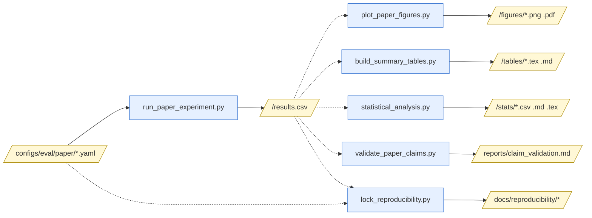

# Scripts Inventory

> **This document is generated by inspection.** It reflects the state
> of `scripts/` at commit `55bf227`. If you change a script's argument
> parser, update this document by re-running the SCRIPTS_INVENTORY
> prompt. Do not edit it manually — manual edits will be overwritten
> on next regeneration.

Last regenerated: 2026-05-08
Generated against commit: 55bf2276286af659f6548a194d15ef635e40c552

## Quick reference

The `scripts/` directory holds 38 CLI entry points, 5 non-CLI helper
modules (the two `__init__.py` files plus three `*_utils` libraries),
and 1 shell helper (`scripts/download_maps.sh`). The CLI scripts
cluster into seven functional groups: (1) the **paper evaluation
pipeline** under `scripts/evaluation/` (sweep runner, plotters, table
builders, statistical analysis, claim validator); (2) the **ablation
study** under `scripts/ablation/`; (3) the **hyper-parameter tuning
suite** under `scripts/tuning/` plus the legacy `run_hyperparameter_tuning.py`
and `plot_tuning_results.py`; (4) the **solver-comparison studies**
(`scripts/run_solver_study.py`, `scripts/solvers/*`,
`scripts/lifelong/*`, plus the two `plot_solver_*.py` figures);
(5) **interactive GUIs** (`run_gui.py`, `run_oneshot_gui.py`,
`run_oneshot_hamapf_gui.py`); (6) **data utilities** (map generators,
task-stream builders, scenario converters, MovingAI fetcher); and
(7) the **release lock** (`scripts/lock_reproducibility.py`). The
high-level paper flow is
`configs/eval/paper/*.yaml → run_paper_experiment.py → results.csv →
{plot_paper_figures, build_summary_tables, statistical_analysis,
validate_paper_claims} → figures, tables, stats reports →
lock_reproducibility.py → docs/reproducibility/`.

## Pipeline diagram



## Scripts → paper sections

| Script | Paper section(s) | Purpose |
|---|---|---|
| `scripts/evaluation/run_paper_experiment.py` | §5 (all sweeps) | Cartesian sweep harness over a paper YAML |
| `scripts/run_sweeps/run_allocator_alternatives.sh` | §5.4 / §5.6 (E14 defensive) | Launches the allocator-alternatives sweep (120 runs, greedy/hungarian/auction × 4 solvers) defending §5.4's allocator-driven attribution |
| `scripts/run_sweeps/run_budget_sensitivity.sh` | §5.1 / §5.6 (E17 defensive) | Launches the budget-sensitivity sweep (160 runs, {1, 5, 10, 30}s × 4 methods on §5.5 cell) defending §5.1's 10s per-call default |
| `scripts/evaluation/plot_paper_figures.py` | §5.2–5.5 | Generates every figure in §5 from `results.csv` |
| `scripts/evaluation/build_summary_tables.py` | §5.2 (Table 1), §5.5 (Table 2) | Builds the two paper summary tables |
| `scripts/evaluation/statistical_analysis.py` | §5 appendix | Paired Wilcoxon + BH-FDR + bootstrap CI tables |
| `scripts/evaluation/validate_paper_claims.py` | All sections | Confirms numeric claims against a fresh sweep |
| `scripts/ablation/run_ablation_study.py` | §5.6 (architecture & safety ablations) | Runs ablation groups A and B |
| `scripts/ablation/plot_ablation.py` | §5.6 | 10 figures from ablation summary |
| `scripts/run_solver_study.py` | §5.2 (motivation) | Solver-substitutability data outside the paper YAMLs |
| `scripts/lock_reproducibility.py` | Reproducibility appendix | Hashes configs + every `results.csv` |
| `scripts/evaluation/run_evaluation.py` | Legacy §5 (HA-LMAPF era) | Predecessor of `run_paper_experiment.py` |
| `scripts/evaluation/plot_results.py` | Legacy §5 | Predecessor of `plot_paper_figures.py` |
| `scripts/run_hyperparameter_tuning.py` | Pre-paper tuning | Old single-binary tuning harness |

## Per-script reference

### `scripts/evaluation/run_paper_experiment.py`

**Purpose:** Paper-experiment harness (POE-LMAPF, paper Section 5).

**Entry point:** Yes.

**Arguments:**

| Flag | Type | Default | Required | Choices | Help |
|---|---|---|---|---|---|
| `--config` | path | — | yes | — | Path to a sweep YAML under configs/eval/paper/ |
| `--out` | path | — | yes | — | Output directory; results.csv and manifest.csv land here |
| `--workers` | int | 1 | no | — | Process-pool size (default 1 = sequential). |
| `--seed-shard` | `i/N` | — | no | — | Distribute seeds across N shards; this process runs shard i. |
| `--resume` | flag | off | no | — | Skip runs whose run_id already appears with status=ok. |
| `--limit` | int | — | no | — | Run at most this many configs (for smoke / debugging). |
| `--log-level` | str | INFO | no | — | (logging level passthrough) |

**Hardcoded behavior:**
- `run_id` is the SHA-256 of the canonical-form config dict; YAML key
  ordering is irrelevant.
- Workers return rows via `Pool.imap_unordered`; main process owns the
  CSV write so partial failures cannot corrupt it.
- When `reference_condition` / `reference_field` /
  `statistical_groupby` / `statistical_metrics` are set in the YAML,
  `statistical_analysis.py` is auto-invoked at the end.

**Reads:** `configs/eval/paper/<name>.yaml`; on `--resume`, the
existing `<out>/results.csv`.

**Writes:** `<out>/results.csv`, `<out>/manifest.csv`.

**Depends on (must run first):** None.

**Used by (downstream consumers):** `plot_paper_figures.py`,
`build_summary_tables.py`, `statistical_analysis.py`,
`validate_paper_claims.py`, `lock_reproducibility.py`.

**Typical invocation:**
```
python scripts/evaluation/run_paper_experiment.py \
    --config configs/eval/paper/solver_sensitivity.yaml \
    --out    logs/paper/solver_sensitivity \
    --workers $(nproc) --resume
```

**Notes:** Re-running with `--resume` is the canonical recovery
strategy after a crash; `run_id`s recovered via SHA-256 match across
sessions.

### `scripts/evaluation/plot_paper_figures.py`

**Purpose:** Paper figure generator.

**Entry point:** Yes.

**Arguments:**

| Flag | Type | Default | Required | Choices | Help |
|---|---|---|---|---|---|
| `--results` | path | — | yes | — | Directory containing results.csv |
| `--out` | path | — | yes | — | Output directory for PNGs |
| `--figure` | str | — | yes | horizon, fov_safety, scaling_agents, scaling_exogenous, baselines, h_r_decoupling, token_passing_ablation, all | (figure to render) |
| `--log-level` | str | INFO | no | — | — |

**Hardcoded behavior:** matplotlib-only (no seaborn); 200 DPI; 95 %
bootstrap CI bands. The mapping from `--figure` value to source sweep
is fixed in code (`horizon` ↔ `solver_sensitivity`, etc.).

**Reads:** `<results>/results.csv`.

**Writes:** `<out>/horizon_sweep_*.png`, `<out>/fov_safety_<map>.png`,
`<out>/scaling_agents_*.png`, `<out>/scaling_exogenous_*.png`,
`<out>/baseline_<map>.png`, plus `_combined.png` overlays.

**Depends on:** `run_paper_experiment.py`.

**Used by:** none — terminal artefact.

**Typical invocation:**
```
python scripts/evaluation/plot_paper_figures.py \
    --results logs/paper/solver_sensitivity \
    --out     figures/paper/horizon \
    --figure  horizon
```

### `scripts/evaluation/build_summary_tables.py`

**Purpose:** Generate the paper's summary tables.

**Entry point:** Yes.

**Arguments:**

| Flag | Type | Default | Required | Choices | Help |
|---|---|---|---|---|---|
| `--results` | path | — | yes | — | Directory containing results.csv |
| `--out` | path | — | yes | — | Output directory for table .tex / .md files |
| `--table` | str | all | no | 1, 2, all | (which table) |
| `--log-level` | str | INFO | no | — | — |

**Hardcoded behavior:** Table 1 filters to `H = 20`; Table 2 filters
to `warehouse-10-20-10-2-2`. These constants live inline.

**Reads:** `<results>/results.csv` (expects either a
`solver_sensitivity` or `baseline_comparison` schema).

**Writes:** `<out>/table1_solver_substitutability.tex|.md`,
`<out>/table2_baseline_comparison.tex|.md`.

**Depends on:** `run_paper_experiment.py` for `solver_sensitivity` and
`baseline_comparison` sweeps.

**Typical invocation:**
```
python scripts/evaluation/build_summary_tables.py \
    --results logs/paper/baseline_comparison \
    --out     paper/tables --table 2
```

### `scripts/evaluation/statistical_analysis.py`

**Purpose:** Paired statistical-analysis pipeline for POE-LMAPF
appendix tables.

**Entry point:** Yes.

**Arguments:**

| Flag | Type | Default | Required | Choices | Help |
|---|---|---|---|---|---|
| `--results` | path | — | yes | — | Directory containing results.csv (or path to the file) |
| `--out` | path | — | yes | — | Output directory for stats artefacts |
| `--groupby` | csv | — | yes | — | Comma-separated list of fields used to form paired groups; the field carrying the condition labels MUST be one of them. |
| `--against` | str | — | yes | — | Reference condition value (e.g. 'ours', 'lacam_official'). |
| `--against-field` | str | auto | no | — | Field whose value matches --against. Default: the first --groupby entry whose values include --against. |
| `--metrics` | csv | — | yes | — | Comma-separated metric column names. |
| `--log-level` | str | INFO | no | — | — |

**Hardcoded behavior:** Significance verdict thresholds `*` p<0.05,
`**` p<0.01, `***` p<0.001 (after BH-FDR adjustment); BCa 95 % CI
when n ≥ 10, normal-approx otherwise.

**Reads:** `<results>/results.csv`.

**Writes:** `<out>/pairwise_comparisons.csv`,
`<out>/friedman_omnibus.csv`, `<out>/descriptive_stats.csv`,
`<out>/significance_report.tex`, `<out>/significance_report.md`.

**Depends on:** `run_paper_experiment.py`.

**Typical invocation:**
```
python scripts/evaluation/statistical_analysis.py \
    --results logs/paper/baseline_comparison \
    --out     stats/paper/baseline_comparison \
    --groupby method,map_path,num_agents,num_humans \
    --against ours \
    --metrics throughput,violations_exogenous_attributable,wait_fraction
```

**Notes:** Auto-invoked by `run_paper_experiment.py` when the YAML
defines `reference_condition`/`statistical_*` keys.

### `scripts/evaluation/validate_paper_claims.py`

**Purpose:** Paper numerical-claim validator.

**Entry point:** Yes.

**Arguments:**

| Flag | Type | Default | Required | Choices | Help |
|---|---|---|---|---|---|
| `--claims` | path | — | yes | — | docs/PAPER_NUMERICAL_CLAIMS.yaml |
| `--results-root` | path | — | yes | — | Directory containing per-sweep result subdirs (e.g. logs/paper/) |
| `--out` | path | — | yes | — | Markdown report path |
| `--tables-out` | path | alongside `--out` | no | — | Optional LaTeX table diff path |
| `--section` | str | all | no | all, 5.2, 5.3, 5.4, 5.5 | (paper section to validate) |
| `--log-level` | str | INFO | no | — | — |

**Hardcoded behavior:** Verdict labels are the literals `Confirmed`,
`Refuted`, `Now stronger`, `Now weaker`, `Skipped`; LaTeX diff is for
Table 1 and Table 2 only.

**Reads:** `docs/PAPER_NUMERICAL_CLAIMS.yaml`,
`<results-root>/<sweep>/results.csv`.

**Writes:** `<out>` (markdown), `<tables-out>` (LaTeX).

**Depends on:** `run_paper_experiment.py` for every sweep referenced
in the claims YAML.

**Typical invocation:**
```
python scripts/evaluation/validate_paper_claims.py \
    --claims docs/PAPER_NUMERICAL_CLAIMS.yaml \
    --results-root logs/paper \
    --out reports/claim_validation.md \
    --tables-out reports/claim_validation_tables.tex \
    --section all
```

**Notes:** Read-only with respect to `docs/PAPER_NUMERICAL_CLAIMS.yaml`;
never edits the registry or the paper text.

### `scripts/lock_reproducibility.py`

**Purpose:** Reproducibility lock for the POE-LMAPF release.

**Entry point:** Yes.

**Arguments:**

| Flag | Type | Default | Required | Choices | Help |
|---|---|---|---|---|---|
| `--out` | path | `docs/reproducibility/` | no | — | Output directory. |
| `--check-only` | flag | off | no | — | Verify recorded hashes match live files; do not rewrite. |
| `--log-level` | str | INFO | no | — | — |

**Hardcoded behavior:** Hashes every `**/*.yaml` under `configs/`
and every `**/results.csv` under `logs/`. Captures `git rev-parse HEAD`,
`python --version`, and `pip freeze`.

**Reads:** `configs/**/*.yaml`, `logs/**/results.csv`, current git
state, current pip env.

**Writes:** `<out>/environment.txt`, `<out>/config_hashes.txt`,
`<out>/results_hashes.txt`, `<out>/MANIFEST.md`.

**Depends on:** Should run **after** all sweeps complete and the
release commit has landed.

**Typical invocation:**
```
python scripts/lock_reproducibility.py            # refresh
python scripts/lock_reproducibility.py --check-only  # CI verify
```

### `scripts/run_solver_study.py`

**Purpose:** Global Solver Selection Study for HA-LMAPF — paper-quality
CSVs to justify global planner choice across three representative
maps and three studies (`solver_baseline`, `scalability`, `time_limit`).

**Entry point:** Yes.

**Arguments:**

| Flag | Type | Default | Required | Choices | Help |
|---|---|---|---|---|---|
| `--study` | str | — | no | solver_baseline, scalability, time_limit | Run a single named study |
| `--all` | flag | off | no | — | Run all three studies |
| `--sanity` | flag | off | no | — | Quick smoke-test: all solvers, 200 steps, seed 0 |
| `--maps` | list | warehouse, room, random | no | warehouse, room, random | Map types to include |
| `--seeds` | list[int] | 0..9 | no | — | Random seeds (default ten) |
| `--steps` | int | 2000 | no | — | Override simulation length |
| `--out` | path | logs/solver_study | no | — | Base output directory |
| `--run-name` | str | `run_YYYYMMDD_HHMMSS` | no | — | Sub-directory name |
| `--workers` | int | 1 | no | — | Parallel workers (0 = all CPU cores) |
| `--verbose` | flag | off | no | — | Print per-run metrics |

**Hardcoded behavior:** Excludes `pylacam` and `rhcr`. Three
representative maps are baked in (`warehouse-10-20-10-2-1.map`,
`room-64-64-8.map`, `random-64-64-10.map`).

**Reads:** map files in `data/maps/`.

**Writes:** `logs/solver_study/<run-name>/results_<study>.csv`,
`summary_<study>.csv`, `metadata/config.json`.

**Depends on:** None (standalone).

**Used by:** `scripts/plot_solver_study.py`,
`scripts/plot_solver_baseline_overview.py`.

**Typical invocation:**
```
python scripts/run_solver_study.py --all --workers 0
```

### `scripts/run_experiments.py`

**Purpose:** Headless experiment runner for HA-LMAPF — load a config,
override seeds, run the simulator, dump metrics.

**Entry point:** Yes.

**Arguments:**

| Flag | Type | Default | Required | Choices | Help |
|---|---|---|---|---|---|
| `--config` | path | — | yes | — | Path to .yaml config file |
| `--seeds` | list[int] | (none) | no | — | List of random seeds to run |
| `--out` | path | logs/default | no | — | Output directory for logs |

**Hardcoded behavior:** Per-seed replay file name
`replay_seed{seed}.json`; metrics header derived from the simulator's
`Metrics.csv_header()`.

**Reads:** the YAML at `--config`, the map referenced therein.

**Writes:** `<out>/metrics.csv`, optional `<out>/replay_seed*.json`.

**Depends on:** None.

**Used by:** None (legacy harness — superseded by
`run_paper_experiment.py`).

**Typical invocation:**
```
python scripts/run_experiments.py \
    --config configs/warehouse_small.yaml --seeds 1 2 3 --out logs/exp_1
```

### `scripts/run_hyperparameter_tuning.py`

**Purpose:** Hyperparameter tuning — systematic parameter sweeps,
multi-map generalisation checks, ablations and baseline comparisons.

**Entry point:** Yes.

**Arguments:**

| Flag | Type | Default | Required | Choices | Help |
|---|---|---|---|---|---|
| `--sweep` | str | — | no | allocator, commit_horizon, delay_threshold, execution_delay, fov_radius, hard_safety, horizon, human_model, num_agents, num_humans, replan_every, safety_radius, solver, task_arrival_rate | Sweep to run (may be repeated) |
| `--all` | flag | off | no | — | Run ALL sensitivity sweeps on the primary map |
| `--multi-map` | flag | off | no | — | Run core sweeps on all 3 canonical maps |
| `--ablations` | flag | off | no | — | Run the 6-condition ablation study |
| `--sanity` | flag | off | no | — | Smoke-test every sweep with 3 values, 1 seed, 1000 steps |
| `--seeds` | list[int] | 0..4 | no | — | Random seeds (≥ 5) |
| `--map` | path | — | no | — | Primary map path |
| `--agents` | int | 20 | no | — | Number of agents in the base config |
| `--humans` | int | 5 | no | — | Number of humans in the base config |
| `--steps` | int | 5000 | no | — | Simulation steps |
| `--output` | path | logs/tuning | no | — | Base output directory |
| `--workers` | int | 1 | no | — | Parallel workers |
| `--verbose` | flag | off | no | — | Print per-run metrics |

**Hardcoded behavior:** Three canonical maps for `--multi-map`
(`warehouse-10-20-10-2-1.map`, `warehouse-20-40-10-2-1.map`,
`room-32-32-4.map`). Default `--seeds` is 5; the script warns that
1000 steps yields too few completed tasks for stable statistics.

**Reads:** map files in `data/maps/`.

**Writes:** `logs/tuning/<timestamp>/results.csv`, `summary.csv`,
per-sweep subfolders with summary + LaTeX tables.

**Depends on:** None.

**Used by:** `scripts/plot_tuning_results.py`.

**Typical invocation:**
```
python scripts/run_hyperparameter_tuning.py --all --workers 0
```

**Notes:** Pre-paper. Use `configs/eval/paper/*.yaml` +
`run_paper_experiment.py` for everything paper-aligned.

### `scripts/ablation/run_ablation_study.py`

**Purpose:** HA-LMAPF ablation study — Group A (tier architecture)
and Group B (safety / perception).

**Entry point:** Yes.

**Arguments:**

| Flag | Type | Default | Required | Choices | Help |
|---|---|---|---|---|---|
| `--seeds` | list[int] | 0..9 | no | — | Random seeds (10 by default) |
| `--map` | path | — | no | — | Single-map override |
| `--agents` | int | — | no | — | — |
| `--humans` | int | — | no | — | — |
| `--steps` | int | — | no | — | — |
| `--workers` | int | 1 | no | — | Parallel workers (0 = all cores) |
| `--verbose` | flag | off | no | — | — |
| `--output` | path | logs/ablation | no | — | — |
| `--label` | str | — | no | — | — |
| `--no-latex` | flag | off | no | — | — |
| `--maps` | list | (primary) | no | — | Multi-map: warehouse_large, warehouse_small, room, or full paths |
| `--scale-configs` | list | — | no | — | `agents:humans` pairs, e.g. '10:2 20:5' |
| `--warmup-steps` | int | 0 | no | — | Discard first N steps as warm-up |
| `--best-horizon` | int | — | no | — | — |
| `--best-replan-every` | int | — | no | — | — |
| `--best-fov-radius` | int | — | no | — | — |
| `--best-safety-radius` | int | — | no | — | — |
| `--best-commit-horizon` | int | — | no | — | — |
| `--best-delay-threshold` | float | — | no | — | — |
| `--groups` | list | A B | no | A, B | A=architecture B=safety |
| `--list-conditions` | flag | off | no | — | Print all ablation conditions and exit. |
| `--sanity` | flag | off | no | — | Quick smoke-test: 1 seed, 200 steps, group A only |

**Hardcoded behavior:** Default maps `random-64-64-10` (50 agents, 20
humans) and `warehouse-10-20-10-2-1` (250 agents, 100 humans). 10
seeds, paired Wilcoxon, BH-FDR, BCa 95 % CIs (BCa when n ≥ 10),
Friedman omnibus, post-hoc power.

**Reads:** map files; on resume there is no resume support — it
overwrites unless `--label` is fresh.

**Writes:** `logs/ablation/<label>_<ts>/results.csv`, `summary.csv`,
`group_A_results.csv`, `group_B_results.csv`, `table.tex`,
`metadata/config.json`.

**Depends on:** None (uses optional `--best-*` flags from the tuning
suite).

**Used by:** `scripts/ablation/plot_ablation.py`.

**Typical invocation:**
```
python scripts/ablation/run_ablation_study.py --workers 0
```

## Compact entries

The following 26 scripts have a single-line purpose and an arguments
table only.

### `scripts/ablation/plot_ablation.py`
**Purpose:** Generate 10 ablation-study figures (bar, forest, scatter,
heatmap, violin, normality, power) from a `summary.csv`.

| Flag | Type | Default | Choices | Help |
|---|---|---|---|---|
| `summary_csv` (positional) | path | — | — | Path to summary.csv from run_ablation_study.py |
| `--raw` | path | — | — | Path to results.csv for violin plots (Fig 8) |
| `-o`, `--output` | path | `<summary_dir>/plots/` | — | Output directory |
| `--figures` | list[int] | all (1–10) | 1..10 | Which figures to generate |

### `scripts/convert_scen_to_json.py`
**Purpose:** Convert a MovingAI `.scen` file to a Lifelong MAPF JSON
task stream.

| Flag | Type | Default | Help |
|---|---|---|---|
| `--scen` | path | — (req) | Input .scen file path |
| `--out` | path | — (req) | Output .json file path |
| `--rate` | int | — | Release rate (steps between tasks). 0 = all at once |
| `--limit` | int | — | Max tasks to convert (optional) |

### `scripts/download_movingai_maps.py`
**Purpose:** Optional helper to download MovingAI maps (or any
`.map`/`.zip` containing maps).

| Flag | Type | Default | Help |
|---|---|---|---|
| `--url` | str | — | HTTP(S) URL to a .map file or zip |
| `--out` | path | data/maps | Output directory |

### `scripts/evaluation/run_evaluation.py`
**Purpose:** Comprehensive evaluation runner for HA-LMAPF (legacy
predecessor of `run_paper_experiment.py`).

| Flag | Type | Default | Choices | Help |
|---|---|---|---|---|
| `--group` | str | all | all, baselines, scalability, human_density, human_models, map_types, ablations, delay_robustness, arrival_rate, robustness, no_humans, classic_mapf | (which experiment group) |
| `--seeds` | list[int] | 0..14 | — | Random seeds |
| `--out` | path | logs/eval | — | — |
| `--save-replay` | flag | off | — | — |
| `--config` | path | — | — | Override: run a single config file with all baselines |

### `scripts/evaluation/plot_results.py`
**Purpose:** Generate publication figures from `run_evaluation.py`
output (legacy plotter).

| Flag | Type | Default | Help |
|---|---|---|---|
| `--results` | path | — | Directory containing evaluation results |
| `--out` | path | — | Output directory for figures |

### `scripts/generate_random_map.py`
**Purpose:** Generate a MovingAI `.map` file with a connectivity check.

| Flag | Type | Default | Help |
|---|---|---|---|
| `--out` | path | — (req) | Output .map file path |
| `--width` | int | — | — |
| `--height` | int | — | — |
| `--density` | float | — | Obstacle density (0.0–1.0) |

### `scripts/lifelong/compare_approach_vs_baselines_agents.py`
**Purpose:** Approach-vs-baselines agent-count sweep on two small maps.
Defaults: `--maps` random, warehouse_small; `--human-models` random;
`--solvers` HA-LMAPF, RHCR; `--seeds` 0..9; `--steps` 2000; `--out`
logs/lifelong/agents; `--run-name baselines_agents_<ts>`;
`--workers 1` (0 = all); `--verbose`, `--sanity` flags.

### `scripts/lifelong/plot_approach_vs_baselines_agents.py`
**Purpose:** Per-map figures for the approach-vs-baselines agent sweep.

| Flag | Type | Default | Choices | Help |
|---|---|---|---|---|
| `--run-dir` | path | — (req) | — | Completed run directory |
| `--output` | path | `<run-dir>/figures/` | — | — |
| `--format` | str | png | png, pdf, svg | PDF is always saved too |

### `scripts/make_task_streams.py`
**Purpose:** Generate a reproducible Lifelong MAPF task stream.

| Flag | Type | Default | Help |
|---|---|---|---|
| `--map` | path | — (req) | MovingAI .map file |
| `--num_tasks` | int | — (req) | Number of tasks |
| `--seed` | int | — (req) | RNG seed |
| `--out` | path | — (req) | Output JSON path |
| `--release_rate` | int | — | Release a new task every k steps |

### `scripts/plot_solver_baseline_overview.py`
**Purpose:** Single 5-panel solver-baseline overview bar chart.
Flags: `-i/--input` (CSV) or `-l/--log-dir` (default
`logs/solver_study`); `-o/--output`; `--map` to filter to a single
`map_tag`; `--no-aggregate`; `--title`; `--bar-width 0.6`.

### `scripts/plot_solver_study.py`
**Purpose:** Plotter for `run_solver_study.py` (schema v2). Flags:
`-s/--study` ∈ {solver_baseline, scalability, time_limit, all}
(default `all`); `-i/--input`; `-l/--log-dir` (default
`logs/solver_study`); `-o/--output`.

### `scripts/plot_tuning_results.py`
**Purpose:** Publication-quality plots from tuning results. Required
`-i/--input` (results.csv); options `-o/--output`, `--all`, `--plot`
∈ {sensitivity, scalability, solver, ablation, pareto, human_density,
safety}, `--param` (for sensitivity), `--x`/`--y` (for pareto).

### `scripts/run_gui.py`
**Purpose:** Run lifelong HA-LMAPF with the pygame GUI. Required:
`--config`. Overrides: `-a/--agents`, `-H/--humans`, `--seed`,
`-s/--solver` ∈ {cbs, lacam, lacam3, lacam_official, pibt2},
`--horizon`, `--replan-every`, `--fov`, `--safety`, `--human-model`
∈ {random_walk, aisle, adversarial, mixed}, `--steps`.

### `scripts/run_oneshot_gui.py`
**Purpose:** One-shot classical MAPF GUI. All flags optional with
defaults: `-a/--agents 10`, `-H/--humans 0`, `-m/--map
random-32-32-20`, `-s/--solver` ∈ {cbs, lacam, lacam3, lacam_official,
pibt2}, `--seed 42`, `--steps 500`, `--replan_every 25`,
`--horizon 50`.

### `scripts/run_oneshot_hamapf_gui.py`
**Purpose:** Human-aware one-shot MAPF GUI. Defaults: `-a/--agents
10`, `-H/--humans 5`, `-m/--map random-32-32-20`, `--fov 5`,
`--safety 1`, hard-safety on (toggle `--no-hard-safety`),
`-s/--solver` ∈ {cbs, lacam, lacam3, lacam_official, pibt2},
`--horizon` auto, `--human-model random_walk`, `--comm-mode token`
∈ {token, priority}, `--seed 42`, `--steps 500`.

### `scripts/solvers/compare_global_study_agents.py`
**Purpose:** Global planner comparison — agent-count sweep across 4
maps × 3 human models × up-to-6 solvers. Defaults: `--maps` random,
warehouse_small, warehouse_large, den520d; `--human-models` random,
aisle, mixed; `--solvers` cbsh2-rtc, PBS, lacam, lacam3, pibt2, lns2;
`--seeds` 0..9; `--steps` 2000; `--out` logs/solvers/agents;
`--run-name compare_<ts>`; `--workers 1` (0 = all); `--verbose`,
`--sanity` flags.

### `scripts/solvers/compare_global_study_human.py`
**Purpose:** Solver comparison — human-count sweep (fixed agents,
varying humans). Same flags as the agents variant; `--out` defaults
to logs/solvers/human, `--run-name human_sweep_<ts>`, default solver
order `lacam, lacam3, pibt2, lns2, PBS, cbsh2-rtc`.

### `scripts/solvers/plot_compare_global_results_agents.py`
**Purpose:** Per-map figures for the agent-count solver comparison.

| Flag | Type | Default | Choices | Help |
|---|---|---|---|---|
| `-r`, `--run-dir` | path | — (req) | — | Run directory |
| `-o`, `--output` | path | `<run-dir>/figures/` | — | — |
| `-f`, `--format` | str | png | png, pdf, svg | PDF always saved |

### `scripts/solvers/plot_compare_global_results_human.py`
**Purpose:** Per-map figures for the human-count solver sweep (same
flags as agents variant).

### `scripts/tuning/plot_tuning.py`
**Purpose:** Conference-quality figures (line+CI, violin, heatmap,
Pareto, LaTeX) from tuning summary CSVs. Required positional
`csv_files`; options `--raw`, `--pareto` (paths to per-seed and
Pareto CSVs), `-o/--output`, mode flags `--heatmap`, `--safety`,
`--allocation`, and `--prefix` for titles.

### `scripts/tuning/tune_horizon.py`
**Purpose:** Tune `horizon` (Step 1) — multi-map, multi-solver.
Defaults: `--seeds 0..14`, `--steps 2000`, `--maps` all 4,
`--values [10,20,30,40,50,60,75,100]`, `--solver lacam` (use `all`
to sweep every solver), plus `--workers/--verbose/--output/--label/
--no-latex/--sanity`.  Writes `<out>/results.csv` incrementally (one
row per completed run, `fsync`d) plus `<out>/.heartbeat` (atomic
single-line progress).  `--output-dir <path>` reuses an existing
directory; `--resume` skips rows already in its `results.csv` via the
`(solver, map_tag, num_agents, horizon, seed)` key tuple.

### `scripts/tuning/tune_horizon_fast.py`
**Purpose:** Reduced-cost variant of `tune_horizon.py` (~51 % faster).
Same flags as `tune_horizon.py` but defaults: 10 seeds, horizons
[20..80], small=all-solvers / large=4-solvers, budget 3 s.

### `scripts/tuning/tune_horizon_faster.py`
**Purpose:** Small-maps-only variant of `tune_horizon_fast.py`. Same
flags; defaults: random + warehouse_small only, 10 seeds, 1500 steps.

### `scripts/tuning/tune_horizon_replan.py`
**Purpose:** Joint horizon × replan_every grid (Step 3). Defaults:
`--seeds 0..4`, `--horizon-values [20,30,40,50,60,75,100]`,
`--replan-values [5,10,15,20,25,30,40,50]`. Standard tuning options:
`--map/--agents/--humans/--steps/--workers/--verbose/--output/
--label/--no-latex`.

### `scripts/tuning/tune_replan_every.py`
**Purpose:** Tune `replan_every` (Step 2). Requires `--best-horizon`.
`--values` default `[5,10,15,20,25,30,40,50]`; only values
≤ `best_horizon` are tested.

### `scripts/tuning/tune_fov_radius.py`
**Purpose:** Tune `fov_radius` (Step 4). Requires `--best-horizon`,
`--best-replan-every`. Default values `[1,2,3,4,5,6,8,10]`.

### `scripts/tuning/tune_safety_radius.py`
**Purpose:** Tune `safety_radius` (Step 5). Requires `--best-horizon`,
`--best-replan-every`, `--best-fov-radius`. Default values `[0..5]`.

### `scripts/tuning/tune_fov_safety.py`
**Purpose:** Joint `fov × safety` grid (Step 6) on warehouse_small +
random. Defaults `--fov-values [2..10]`, `--safety-values [1..5]`.
Constraint: `fov_radius > safety_radius`.

### `scripts/tuning/tune_commit_delay.py`
**Purpose:** Joint `commit_horizon × delay_threshold` grid (Step 7,
final). Requires all four `--best-*` flags. Defaults
`--commit-values [0,5,10,25,50,100]`,
`--delay-values [0.0,1.5,2.0,2.5,3.0,4.0]`.

## Helpers and modules (non-CLI)

### `scripts/ablation/__init__.py`
Empty package marker.

### `scripts/ablation/ablation_utils.py`
**Purpose:** Shared definitions of ablation Groups A and B (conditions,
maps, statistical methodology). Defines paired Wilcoxon, BH-FDR,
rank-biserial, BCa bootstrap, and Friedman omnibus helpers.

**Used by:** `scripts/ablation/run_ablation_study.py`,
`scripts/ablation/plot_ablation.py`.

### `scripts/tuning/__init__.py`
Empty package marker.

### `scripts/tuning/tuning_utils.py`
**Purpose:** Shared statistical machinery for the tuning suite —
Wilcoxon signed-rank, BH-FDR, rank-biserial, 95 % bootstrap CI,
sensitivity score, plus the `STATS_METRICS` and `pareto.csv` schema.
Defines the `results.csv`, `summary.csv`, `pareto.csv`, `table.tex`
output contract.

**Used by:** every `scripts/tuning/tune_*.py`.

### `scripts/download_maps.sh`
**Purpose:** Shell helper that downloads the MovingAI map archive into
`data/maps/`. Run once at setup. Not a CLI Python script; takes no
flags.

(`scripts/evaluation/__pycache__` is bytecode and intentionally
skipped.)

## Configs catalog

### `configs/eval/paper/budget_sensitivity.yaml`
**Purpose:** E17 defensive sweep — per-call solver-budget sensitivity
on the §5.5 warehouse cell (defends §5.1's 10s default against "your
relative-advantage claim only holds at this specific budget").
**Sweep dimensions:** `solver_timeout_s` × `method` × seeds (single
map, single density).
- `solver_timeout_s`: 1.0, 5.0, 10.0, 30.0 (4)
- `method`: ours, rhcr, pibt2_fr, no_buffer (4)
- `map_path`: warehouse-10-20-10-2-2 (1)
- seeds: 0..9 (10)

**Total runs:** 4 × 4 × 1 × 10 = **160**.
**Simulation steps:** 1500 (anchored to §5.5; stem absent from
`PAPER_SECTION_TO_STEPS`, harness only warns).
**Solver timeout:** swept axis (see above).
**Other fixed:** `num_agents = 200`, `num_humans = 100`, `fov_radius = 4`,
`safety_radius = 1`, `global_solver = lacam_official`, `horizon = 20`,
`replan_every = 10`, `hard_safety = true`,
`communication_mode = priority`, `local_planner = astar`,
`task_allocator = congestion_avoidance`, `mode = lifelong`, `human_model =
random_walk` (overridden to `aisle` for the warehouse map via
`map_to_human_model`).
**Reference condition:** `ours`. `statistical_groupby:
solver_timeout_s,method,map_path,num_agents` (groups by budget so the
ranking is read independently at each budget). Stats metrics:
`throughput, violations_exogenous_attributable, wait_fraction,
solver_timeouts, solver_errors`.

### Recognized `task_allocator` strings (simulator factory)

The `SimConfig.task_allocator` field accepts the following string
identifiers (case-insensitive); unknown strings fall back to
`greedy`:

| String | Class | Hyperparameters | Notes |
| --- | --- | --- | --- |
| `greedy` | `GreedyNearestTaskAllocator` | — | Default. Per-task nearest-agent by Manhattan distance to pickup. |
| `hungarian` | `HungarianTaskAllocator` | — | Hungarian matching on Manhattan distance to pickup. |
| `auction` | `AuctionBasedTaskAllocator` | `max_iterations=100`, `epsilon=0.01` | Sequential single-item auction. |
| `congestion_avoidance` | `CongestionAvoidanceTaskAllocator` | `lambda_conflict=0.5`, `max_rounds=5` | **Production default (activated 2026-05-13)**. Direction A iterated Hungarian over BFS distances plus a path-overlap penalty. Requires `Environment.is_blocked` (wired automatically by the simulator). All `configs/eval/paper/*.yaml` and `configs/eval/default.yaml` were updated to this value at v1.4-pre-direction-a-activation. |

The `make_allocator(name, **kwargs)` factory in
`src/ha_lmapf/task_allocator/__init__.py` forwards `lambda_conflict`
and `max_rounds` to `CongestionAvoidanceTaskAllocator`.

### `configs/eval/paper/allocator_alternatives.yaml`
**Purpose:** E14 defensive sweep — allocator alternatives on §5.4 cohort
(defends the allocator-driven attribution against "you only tested greedy").
**Sweep dimensions:** `task_allocator` × `global_solver` × seeds (single map, single density).
- `task_allocator`: greedy, hungarian, auction, congestion_avoidance (4)
- `global_solver`: lacam_official, lacam, lns2, pibt2 (4)
- `map_path`: warehouse-10-20-10-2-2 (1)
- seeds: 0..9 (10)

**Total runs:** 4 × 4 × 1 × 10 = **160** (post-Direction-A; was 120 = 3 × 4 × 1 × 10 prior to v1.4-pre-direction-a-activation).
**Simulation steps:** 1500 (anchored to §5.5; stem absent from
`PAPER_SECTION_TO_STEPS`, harness only warns).
**Solver timeout:** 10.0 s.
**Other fixed:** `num_agents = 200`, `num_humans = 100`, `fov_radius = 4`,
`safety_radius = 1`, `horizon = 20`, `replan_every = 10`,
`hard_safety = true`, `communication_mode = priority`,
`local_planner = astar`, `mode = lifelong`, `human_model = random_walk`
(overridden to `aisle` for the warehouse map via `map_to_human_model`).
**Reference condition:** `greedy`. `statistical_groupby:
task_allocator,global_solver,map_path,num_agents`. Stats metrics:
`throughput, violations_agent_attributable, wait_fraction, solver_errors`.

### `configs/eval/paper/solver_sensitivity.yaml`
**Purpose:** Section 5.2 — Tier-1 solver substitutability.
**Sweep dimensions:** `global_solver` × `horizon` × `num_agents` ×
`map_path` × seeds.
- `global_solver`: cbsh2, lacam, lacam_official, lns2, pbs, pibt2 (6)
- `horizon`: 20, 30, 40, 50, 60, 70, 80 (7)
- `num_agents`: 25, 50, 75, 100 (4)
- `map_path`: random-64-64-10, warehouse-10-20-10-2-2 (2)
- seeds: 0..9 (10)

**Total runs:** 6 × 7 × 4 × 2 × 10 = **3360**.
**Simulation steps:** 2000.
**Solver timeout:** 10.0 s.
**Other fixed:** `num_humans = 50`, `fov_radius = 4`,
`safety_radius = 1`, `hard_safety = true`,
`communication_mode = priority`, `local_planner = astar`,
`task_allocator = congestion_avoidance`, `replan_every = 10`,
`mode = lifelong`.
**Reference condition:** `lacam_official` (paired stats vs. each
other solver within (map, horizon, num_agents) cells).

### `configs/eval/paper/fov_safety.yaml`
**Purpose:** Section 5.3 — FoV × safety-radius sweep.
**Sweep dimensions:** `fov_radius` × `safety_radius` × `map_path` ×
seeds.
- `fov_radius`: 2, 3, 4, 5, 6 (5)
- `safety_radius`: 0, 1, 2, 3 (4)
- `map_path`: random-64-64-10, warehouse-10-20-10-2-2 (2)
- seeds: 0..9 (10)

**Total runs:** 5 × 4 × 2 × 10 = **400**.
**Simulation steps:** 2000.
**Solver timeout:** 10.0 s.
**Other fixed:** `num_agents = 50`, `num_humans = 50`,
`global_solver = lacam_official`, `horizon = 20`, `replan_every = 10`,
`hard_safety = true`, `communication_mode = priority`,
`local_planner = astar`, `task_allocator = congestion_avoidance`,
`mode = lifelong`.
**Reference condition:** None (no `reference_condition` key).

### `configs/eval/paper/scaling_agents.yaml`
**Purpose:** Section 5.4 part 1 — scaling in |M| (controlled agents).
**Sweep dimensions:** three asymmetric groups (one per map):
- random-64-64-10 (|X|=20): `num_agents` in [10..90 step 10] = 9
- warehouse-10-20-10-2-1 (|X|=40): [50..400 step 50] = 8
- warehouse-10-20-10-2-2 (|X|=60): [50..450 step 50] = 9

`global_solver` ∈ {lacam_official, lacam, lns2, pibt2} (4) × seeds 0..9.

**Total runs:** 4 × (9 + 8 + 9) × 10 = **1040**.
**Simulation steps:** 2000.
**Solver timeout:** 10.0 s.
**Other fixed:** `fov_radius = 4`, `safety_radius = 1`, `horizon = 20`,
`replan_every = 10`, `hard_safety = true`,
`communication_mode = priority`, `local_planner = astar`,
`task_allocator = congestion_avoidance`, `mode = lifelong`.
**Reference condition:** None.

### `configs/eval/paper/scaling_exogenous.yaml`
**Purpose:** Section 5.4 part 2 — scaling in |X| (exogenous agents).
**Sweep dimensions:** three asymmetric groups (one per map):
- random-64-64-10 (|M|=50): `num_humans` in [10, 20, 40, 60, 80, 100] = 6
- warehouse-10-20-10-2-1 (|M|=100): [20, 40, 60, 80, 100, 120] = 6
- warehouse-10-20-10-2-2 (|M|=150): [20, 40, 60, 80, 100, 120, 150] = 7

`global_solver` ∈ {lacam_official, lacam, lns2, pibt2} (4) × seeds 0..9.

**Total runs:** 4 × (6 + 6 + 7) × 10 = **760**.
**Simulation steps:** 2000.
**Solver timeout:** 10.0 s.
**Other fixed:** identical to `scaling_agents.yaml`.
**Reference condition:** None.

### `configs/eval/paper/baseline_comparison.yaml`
**Purpose:** Section 5.5 — baseline-comparison table.
**Sweep dimensions:** two map-specific groups, both varying `method` ×
`num_agents`:
- random-64-64-10 (|X|=20): `num_agents` 9 values × 4 methods
- warehouse-10-20-10-2-2 (|X|=100): `num_agents` 9 values × 4 methods

`method` ∈ {ours, rhcr, pibt2_fr, no_buffer} (4); seeds 0..9.

**Total runs:** 4 × (9 + 9) × 10 = **720**.
**Simulation steps:** 1500 (paper §5.5 uses a shorter run).
**Solver timeout:** 10.0 s.
**Other fixed:** `fov_radius = 4`, `safety_radius = 1`,
`global_solver = lacam_official`, `horizon = 20`, `replan_every = 10`,
`hard_safety = true`, `communication_mode = priority`,
`local_planner = astar`, `task_allocator = congestion_avoidance`,
`mode = lifelong`.
**Reference condition:** `ours`. `statistical_groupby:
method,map_path,num_agents,num_humans`. Stats metrics: `throughput,
violations_agent_attributable, violations_exogenous_attributable,
wait_fraction`.

### `configs/eval/paper/token_passing_ablation.yaml`
**Purpose:** §4.3 hanging-promise ablation — Token Passing vs.
Priority Rules.
**Sweep dimensions:** `communication_mode` × `num_agents` × seeds.
- `communication_mode`: priority, token (2)
- `num_agents`: 50, 150, 250 (3)
- seeds: 0..9 (10)

**Total runs:** 2 × 3 × 10 = **60**.
**Simulation steps:** 1500 (matches §5.5).
**Solver timeout:** 10.0 s.
**Other fixed:** `num_humans = 100`, `fov_radius = 4`,
`safety_radius = 1`, `global_solver = lacam_official`, `horizon = 20`,
`replan_every = 10`, `hard_safety = true`, `local_planner = astar`,
`task_allocator = congestion_avoidance`, `map_path = warehouse-10-20-10-2-2.map`,
`mode = lifelong`.
**Reference condition:** None set in YAML (run `statistical_analysis.py`
manually with `--against priority`).

### `configs/eval/paper/aux_h_r_decoupling.yaml`
**Purpose:** Reviewer-3 auxiliary — H/R decoupling on
warehouse-10-20-10-2-2.
**Sweep dimensions:** three groups (one per horizon), each enumerating
the valid `replan_every` grid (degenerate `R ≥ H` cells dropped):
- H = 20: R ∈ {1, 5, 10} (3 cells)
- H = 40: R ∈ {1, 5, 10, 20} (4)
- H = 80: R ∈ {1, 5, 10, 20} (4)

seeds: 0..9.

**Total runs:** 11 × 10 = **110**.
**Simulation steps:** 2000.
**Solver timeout:** 10.0 s.
**Other fixed:** `num_agents = 50`, `num_humans = 50`,
`fov_radius = 4`, `safety_radius = 1`,
`global_solver = lacam_official`, `hard_safety = true`,
`communication_mode = priority`, `local_planner = astar`,
`task_allocator = congestion_avoidance`, `human_model = random_walk`
(map override `aisle`), `mode = lifelong`.
**Reference condition:** None — staged for response-letter material;
not yet auto-piped through `statistical_analysis.py`.

## Common pitfalls

- The `solver_timeout_s: 10.0` field is set per-config in every paper
  YAML; if you change the `SimConfig.solver_timeout_s` default in
  `core/types.py`, the YAMLs win. Update the YAMLs too.
- The harness creates `<out>/` if missing, but `lock_reproducibility.py`
  silently skips `logs/` if it doesn't exist — make sure sweeps have
  actually produced `results.csv` before locking.
- `lock_reproducibility.py` captures the active git commit; run it
  AFTER every paper-relevant commit lands or the recorded SHA will
  drift from the artefacts it hashes.
- Several solver wrappers (PIBT2, RHCR) are environment-sensitive on
  this CI image; smoke tests skip them. See `docs/SOLVER_STATUS.md`
  before treating a missing-solver error as a code bug.
- The `scripts/tuning/` and `scripts/run_hyperparameter_tuning.py`
  scripts are exploratory and predate the paper sweep. For
  paper-aligned reproducibility prefer `configs/eval/paper/*.yaml`
  + `run_paper_experiment.py`.
- `--resume` in `run_paper_experiment.py` keys on the SHA-256
  `run_id`; if you edit the YAML between runs the `run_id` changes
  and old rows will not be reused. This is intentional — but it means
  every `base:` edit invalidates the entire previous CSV.
- Several scripts (`run_evaluation.py`, `run_experiments.py`,
  `run_hyperparameter_tuning.py`) are legacy; prefer the
  `run_paper_experiment.py` pipeline unless you specifically need the
  legacy output schema.

## Maintenance

This document was generated from script source by the SCRIPTS_INVENTORY
prompt. To regenerate after script changes, re-run that prompt; the
output should match the current state of `scripts/` exactly. If a new
script is added or an existing one's interface changes, this file
drifts — re-run.

## Broken scripts

None encountered. Every CLI entry point in `scripts/` produced a clean
`--help` output (no Python tracebacks observed in
`/tmp/scripts_inventory/help_outputs.txt`).
